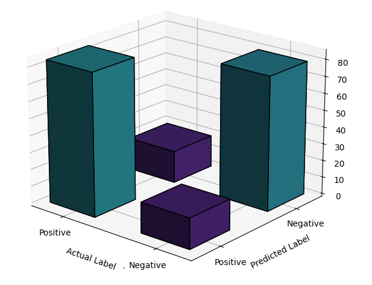

# Natural Language Processing Text Classification

This project demonstrates text classification using Natural Language Processing (NLP) on restaurant reviews. It involves preprocessing text data, building a Bag of Words model, and applying various machine learning classifiers, including Naive Bayes, SVM, Random Forest, Logistic Regression, and K-Nearest Neighbors. The project also features a 3D visualization of the confusion matrix to analyze model performance.

## Table of Contents

- [Installation](#installation)
- [Usage](#usage)
- [Results](#results)
- [Visualization](#visualization)

## Installation

To get started with this project, ensure you have Python installed. Then, install the required libraries using:

```bash
pip install numpy pandas matplotlib scikit-learn nltk
```

## Usage

1. **Import Libraries**

   Import the necessary libraries:

   ```python
   import numpy as np
   import matplotlib.pyplot as plt
   import pandas as pd
   import re
   import nltk
   from nltk.corpus import stopwords
   from nltk.stem.porter import PorterStemmer
   from sklearn.feature_extraction.text import CountVectorizer
   from sklearn.model_selection import train_test_split
   from sklearn.metrics import confusion_matrix, accuracy_score
   from sklearn.naive_bayes import GaussianNB
   from sklearn.svm import SVC
   from sklearn.ensemble import RandomForestClassifier
   from sklearn.linear_model import LogisticRegression
   from sklearn.neighbors import KNeighborsClassifier
   ```

2. **Import the Dataset**

   Load the dataset:

   ```python
   dataset = pd.read_csv('Restaurant_Reviews.tsv', delimiter='\t', quoting=3)
   ```

3. **Clean the Texts**

   Process the reviews:

   ```python
   nltk.download('stopwords')
   corpus = []
   for i in range(0, 1000):
       review = re.sub('[^a-zA-Z]', ' ', dataset['Review'][i])
       review = review.lower()
       review = review.split()
       ps = PorterStemmer()
       all_stopwords = stopwords.words('english')
       all_stopwords.remove('not')
       review = [ps.stem(word) for word in review if not word in set(all_stopwords)]
       review = ' '.join(review)
       corpus.append(review)
   ```

4. **Create the Bag of Words Model**

   Convert text to a format suitable for ML models:

   ```python
   cv = CountVectorizer(max_features=1500)
   X = cv.fit_transform(corpus).toarray()
   y = dataset.iloc[:, -1].values
   ```

5. **Split the Dataset**

   Divide the data into training and test sets:

   ```python
   X_train, X_test, y_train, y_test = train_test_split(X, y, test_size=0.20, random_state=0)
   ```

6. **Train and Evaluate Classifiers**

   Train and evaluate various classifiers:

   ```python
   classifierNB = GaussianNB()
   classifierNB.fit(X_train, y_train)
   weightNB = accuracy_score(y_test, classifierNB.predict(X_test))

   classifierSVM = SVC(kernel='linear', random_state=0)
   classifierSVM.fit(X_train, y_train)
   weightSVM = accuracy_score(y_test, classifierSVM.predict(X_test))

   classifierRF = RandomForestClassifier(n_estimators=1000, criterion='entropy', random_state=42)
   classifierRF.fit(X_train, y_train)
   weightRF = accuracy_score(y_test, classifierRF.predict(X_test))

   classifierLR = LogisticRegression(random_state=0)
   classifierLR.fit(X_train, y_train)
   weightLR = accuracy_score(y_test, classifierLR.predict(X_test))

   classifierKNN = KNeighborsClassifier(n_neighbors=5, metric='minkowski', p=2)
   classifierKNN.fit(X_train, y_train)
   weightKNN = accuracy_score(y_test, classifierKNN.predict(X_test))
   ```

7. **Combine Predictions**

   Aggregate predictions from all classifiers:

   ```python
   weightAll = weightKNN + weightLR + weightNB + weightRF + weightSVM
   threshold = 0.4
   y_pred = 1 * (weightNB * classifierNB.predict(X_test) +
                 weightRF * classifierRF.predict(X_test) +
                 weightLR * classifierLR.predict(X_test) +
                 weightKNN * classifierKNN.predict(X_test) +
                 weightSVM * classifierSVM.predict(X_test)) > threshold * weightAll
   ```

## Results

Evaluate the combined model's performance:

```python
cm = confusion_matrix(y_test, y_pred)
print(cm)
print(accuracy_score(y_test, y_pred))
```

The confusion matrix and accuracy score will be displayed in the output.

## Visualization

Visualize the confusion matrix in 3D:

```python
from mpl_toolkits.mplot3d import Axes3D

fig = plt.figure(figsize=(10, 7))
ax = fig.add_subplot(111, projection='3d')

xpos, ypos = np.meshgrid(np.arange(cm.shape[0]), np.arange(cm.shape[1]), indexing="ij")
xpos = xpos.ravel()
ypos = ypos.ravel()
zpos = np.zeros_like(xpos)

dx = dy = 0.5
dz = cm.ravel()

colors = plt.cm.viridis(0.45*dz / np.max(dz))

ax.bar3d(xpos, ypos, zpos, dx, dy, dz, zsort='average', color=colors, edgecolor='black')
ax.set_xlabel('Actual Label')
ax.set_ylabel('Predicted Label')
ax.set_zlabel('Count')
ax.set_xticks(np.arange(cm.shape[0]) + dx / 2)
ax.set_xticklabels(['Negative', 'Positive'])
ax.set_yticks(np.arange(cm.shape[1]) + dy / 2)
ax.set_yticklabels(['Negative', 'Positive'])
plt.title('3D Visualization of Confusion Matrix')
ax.view_init(elev=20, azim=130)
plt.show()
```
Below is the graphical representation of the confusion matrix.

*A 3D visualization of the confusion matrix is provided to illustrate the model's performance*
